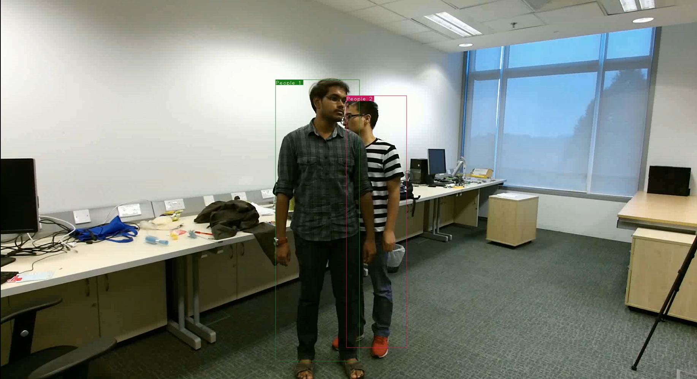
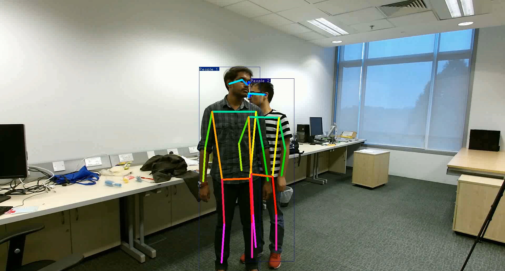
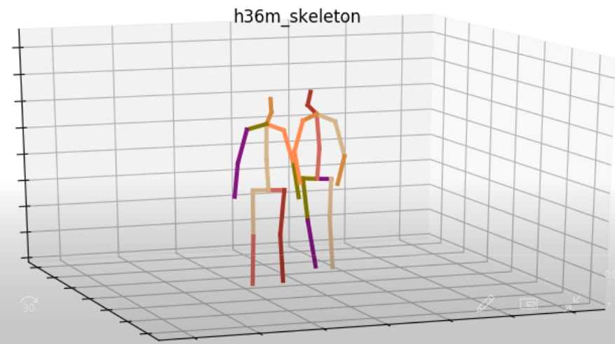
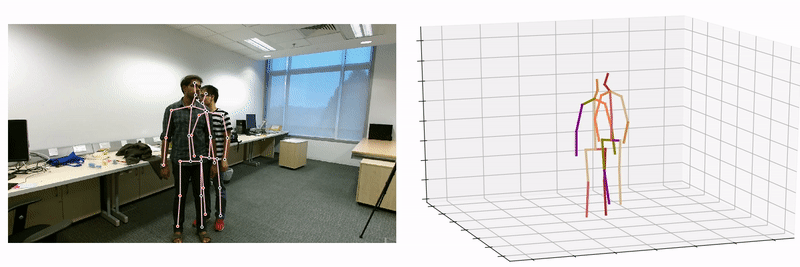

# Inference in the wild 
Language: [[English]](INFERENCE_EN.md) [[中文]](INFERENCE_CH.md)

In this short tutorial, we show how to run our model on arbitrary videos and visualize the predictions. Note that this feature is only provided for experimentation/research purposes and presents some limitations, as this repository is meant to provide a reference implementation of the approach described in the paper (not production-ready code for inference in the wild).

- Our script have achieved single and two-person 3D pose estimation on custom videos. This repository provides an API to generate 3D joint coordinates and rendering animation. You can add other detector and 2D pose estimation methods based on our scripts. You can also apply it to other high-level tasks, such as [skeleton-based action recognition](https://github.com/fabro66/Online-Skeleton-based-Action-Recognition).

- Pipeline: We adopt YOLOv3 and SORT for human detection and tracking, HRNet for 2D pose
estimation, and GAST-Net for 2D-to-3D pose reconstruction.

<div align=center>
          
</div>

## Download pretrained model
- Prepare YOLOv3 pretrained model：
``` cd root_path
    cd checkpoint
    mkdir yolov3
    wget https://pjreddie.com/media/files/yolov3.weights
```


- Prepare HRNet pretrained model:
``` cd checkpoint
    mkdir hrnet
    cd hrnet
    mkdir pose_coco
```
Download HRNet pretrained model[[pose_hrnet_w48_384x288.pth]](https://github.com/leoxiaobin/deep-high-resolution-net.pytorch), put it to *pose_coco* dir.


- Prepare GAST-Net pretrained model:
``` cd checkpoint
    mkdir gastnet
```
Download GAST-Net pretrained model[[27_frame_model.bin]](https://drive.google.com/file/d/1vh29QoxIfNT4Roqw1SuHDxxKex53xlOB/view?usp=sharing), put it to *gastnet* dir

```
    ${root_path}
    -- checkpoint
        |-- yolov3
            |-- yolov3.weights
        |-- hrnet
            |-- pose_coco
                |-- pose_hrnet_w48_384x288.pth
        |-- gastnet
            |-- 27_frame_model.bin
```
## Generating rendering animation
- Single-person 3D pose estimation：
```
    python gen_skes.py -v baseball.mp4 -np 1 --animation
```

- Two-person 3D pose estimation：
```
    python gen_skes.py -v apart.avi -np 2 --animation
```



-- The result can be found in the **output** dir.

## Generating 3D joint coordinates
- Single-person 3D pose estimation：
```
    python gen_skes.py -v baseball.mp4 -np 1
```
