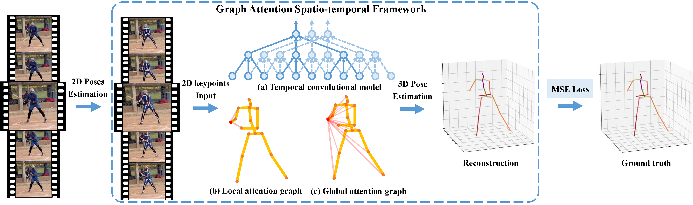

# A Graph Attention Spatio-temporal Convolutional Networks for 3D Human Pose Estimation in Video (GAST-Net)

### Introduction
3D pose estimation in video benefits from both temporal and spatial information. Spatiotemporal information can help tackle occlusion and depth ambiguities, which are outstanding problems. Previous methods focused more on time consistency and did not propose an effective way combined with spatial semantics. In this work, we improve the learning of kinematic constraints in the human skeleton; namely posture, 2nd order joint relations, and symmetry. We do this by modeling both local and global spatial information via attention mechanisms. Also, importantly, we carefully design the interleaving of spatial information with temporal information to achieve a synergistic effect.
We contribute a simple and effective graph attention spatio-temporal convolutional network (GAST-Net) that comprises of interleaved temporal convolutional and graph attention blocks.
Local 2nd order and symmetric constraints can mitigate depth ambiguities for these joints with only one first-order neighbor (like ankle \emph{et al.}), while global posture semantics can more effectively combine time information to address self-occlusion. 
Experiments on two challenging benchmark datasets, Human3.6M and HumanEva-I, show that we achieve 4.1\% and 8.2\% improvements.

### FrameWork



### Dependencies
Make sure you have the following dependencies installed before proceeding:
- Python 3+ distribution
- PyTorch >= 1.0.1
- matplotlib
- numpy

### Data preparation
- Download the raw data from [Human3.6M](http://vision.imar.ro/human3.6m) and [HumanEva-I](http://humaneva.is.tue.mpg.de/)
- Preprocess the dadaset in the same way as like [TCNs[21]](https://github.com/facebookresearch/VideoPose3D/blob/master/DATASETS.md)
- Then put the preprocessed dataset under the data directory

       -data\
            data_2d_h36m_gt.npz
            data_3d_36m.npz
            data_2d_h36m_cpn_ft_h36m_dbb.npz
            data_2d_h36m_sh_ft_h36m.npz
        
            data_2d_humaneva15_gt.npz
            data_3d_humaneva15.npz
            data_2d_humaneva15_detectron_pt_coco.npz

### Training & Testing
If you want to reproduce the results of our paper, run the following commands.

For Human3.6M:
```
python trainval.py -e 60 -k cpn_ft_h36m_dbb -arc 3,3,3 -drop 0.05 -b 128
```

For HumanEva:
```
python trainval.py -d humaneva15 -e 200 -k detectron_pt_coco -d humaneva15 -arc 3,3,3 -drop 0.5 -b 32 -lr 0.98 -str Train/S1,Train/S2,Train/S3 -ste Validate/S1,Validate/S2,Validate/S3 -a Walk,Jog,Box --by-subject
```

To test on Human3.6M, run:
```
python trainval.py -k cpn_ft_h36m_dbb -arc 3,3,3 -c checkpoint --evaluate epoch_60.bin
```

To test on HumanEva, run:
```
python trainval.py -k detectron_pt_coco -arc 3,3,3 -str Train/S1,Train/S2,Train/S3 -ste Validate/S1,Validate/S2,Validate/S3 -a Walk,Jog,Box --by-subject -c checkpoint --evaluate epoch_60.bin
```


### Inference in the wild
Reconstruct 3D pose from 2D keypoint predicted from 2D detector (Mask RCNN, HRNet and OpenPose et al), and visualize it.
```
python reconstruction.py -c epoch_60.bin -k ../keypoints.npz -vi ../sittingdown.mp4 -vo ./output/output_animation.mp4 -kf coco
```
* Reconstructed from YouTube video


* Reconstructed from [NTU-RGBD](http://rose1.ntu.edu.sg/datasets/actionrecognition.asp) dataset 


### Reference

This repository holds the code for the following paper:

[A Graph Attention Spatio-temporal Convolutional Networks for 3D Human Pose Estimation in Video]().

If you find our paper and repo useful, please cite our paper. Thanks!

```


```